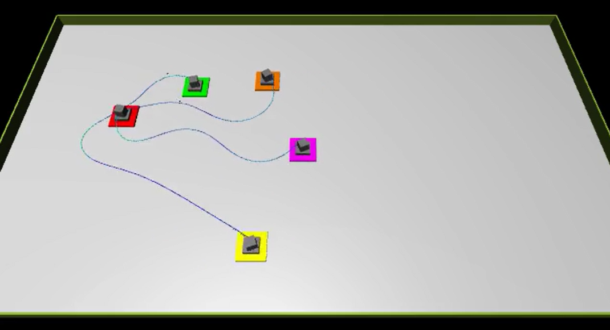

# Wire Harness Routing — Gymnasium Environment

A [Gymnasium](https://gymnasium.farama.org/)-compatible reinforcement learning environment for **multi-agent wire harness routing** on a production table, simulated in [MuJoCo](https://mujoco.org/).

Five robotic movers cooperatively route cables (wire harnesses) to a sequence of target configurations while avoiding collisions.



---

## Installation

**Requirements:** Python ≥ 3.10, a working MuJoCo installation.

```bash
git clone https://github.com/ludwigstr/MAPP4WH.git
cd MAPP4WH
pip install -e .
```

---

## Quick Start

```python
import mapp4wh_env          # registers "WireHarness-v0"
import gymnasium as gym

env = gym.make("WireHarness-v0")
obs, info = env.reset()

for _ in range(200):
    action = env.action_space.sample()   # random agent
    obs, reward, terminated, truncated, info = env.step(action)
    if terminated or truncated:
        obs, info = env.reset()

env.close()
```

---

## Environment Details

| Property | Value |
|---|---|
| **ID** | `WireHarness-v0` |
| **Observation space** | `Box(-inf, inf, (31,), float32)` |
| **Action space** | `Box(-1, 1, (10,), float32)` |
| **Max steps per episode** | 250 |
| **Physics engine** | MuJoCo 3.x |

### Observation (31 values)
- Pairwise distances and angles between all 5 movers (20 values)
- Distance and angle to each mover's individual target (10 values)
- Current target configuration index (1 value)

### Action (10 values)
Two continuous residual correction values per mover `[−1, 1]`:
- Value at `2*i`: tangential rotation correction for mover `i`
- Value at `2*i+1`: radial correction for mover `i`

### Reward
- `+25` when all movers reach their targets (episode success)
- `−1` per step (time penalty)
- `−0.005 × cable_collision_cells` per mover
- `−0.1 × mover_collision_cells` per mover
- `+5 × progress` shaped reward (distance improvement per step)

---

## Configuration

All parameters are in [config.py](config.py). Key settings:

```python
NUM_MOVERS = 5              # number of robotic movers
MAX_TRAJECTORY_LENGTH = 250 # max steps per episode
VEL = 2                     # base mover velocity [m/s]
TARGET_SEQUENCE = [4,2,3,1,0]  # order of target configurations
```

---

## Project Structure

```
├── __init__.py          # gymnasium.register("WireHarness-v0")
├── wire_harness_env.py  # WireHarnessEnv (gym.Env) — main entry point
├── environment.py       # MuJoCo simulation core
├── mover.py             # single-agent robot class
├── config.py            # all parameters
├── calculations.py      # geometry helpers
├── xml_utils.py         # MuJoCo XML utilities
├── pyproject.toml       # package definition
└── data/
    ├── WireHarness012e.xml   # MuJoCo scene model
    └── simulation_config/    # body/geometry configs
```

---

## Training with Stable-Baselines3

```python
from stable_baselines3 import SAC
import mapp4wh_env
import gymnasium as gym

env = gym.make("WireHarness-v0")
model = SAC("MlpPolicy", env, verbose=1)
model.learn(total_timesteps=500_000)
model.save("sac_wire_harness")
```

---

## Citation

If you use this environment in your research, please cite:

```
@software{mapp4wh_tnt_sb3,
  title  = {Wire Harness Routing Gymnasium Environment},
  year   = {2025},
  url    = {https://github.com/ludwigstr/MAPP4WH}
}
```
